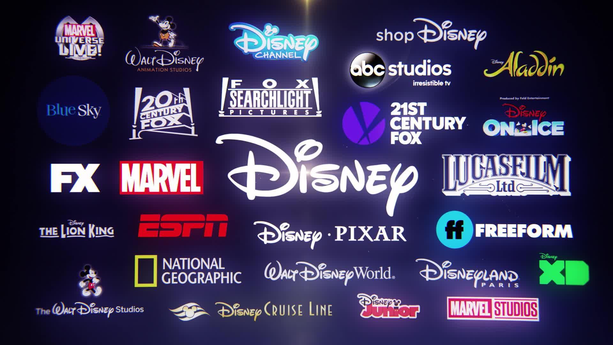
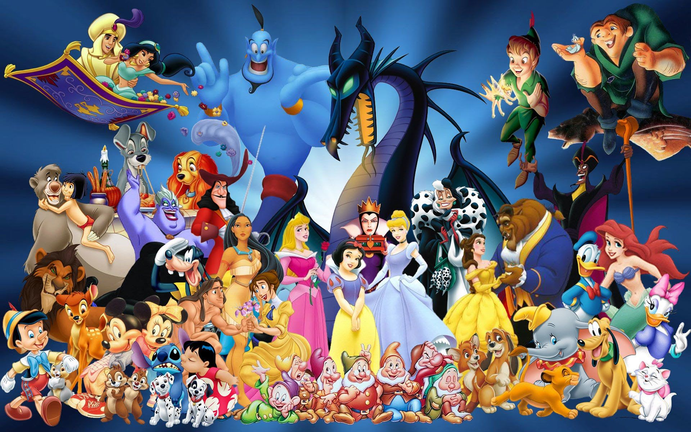
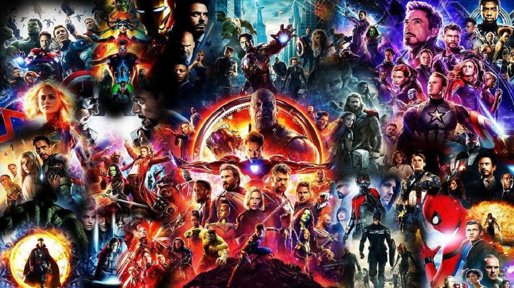

```{css, echo = FALSE}
.columns {display:flex;}
h1.title {font-size: 40 px;color: 	#FFF5EE}
h1 {color:		#FFF5EE; font-size: 30px ;font-family: Arial Black}
h2{color: 	#FFF5EE; font-size: 20px; font-family: Arial}
body { background-color: #FF6347}
a {color: #010101;}
.list-group-item.active, .list-group-item.active:focus, .list-group-item.active:hover {
    z-index: 2;
    color: ;
    background-color: #c4342d;
    border-color: palered;
}
.nav-pills > li.active > a, .nav-pills > li.active > a:hover, .nav-pills > li.active > 
```


```{r packages-setup, include = FALSE}
library(tidyverse)
library(klippy)  #- remotes::install_github("rlesur/klippy")
library(knitr)
```

```{r chunk-setup, include = FALSE}
knitr::opts_chunk$set(echo = TRUE, eval = TRUE, message = FALSE, warning = FALSE, 
                      #results = "hold",
                      cache = FALSE, cache.path = "/caches/", comment = "#>",
                      #fig.width = 7, #fig.height= 7,   
                      #out.width = 7, out.height = 7,
                      collapse = TRUE,  fig.show = "hold",
                      fig.asp = 0.628, out.width = "75%", fig.align = "center")
knitr::opts_chunk$set(dev = "png", dev.args = list(type = "cairo-png"))
```


```{r options-setup, include = FALSE}
options(scipen = 999) #- para quitar la notación científica
options("yaml.eval.expr" = TRUE) 
```


```{r klippy, echo = FALSE}
klippy::klippy(position = c("top", "right")) #- remotes::install_github("rlesur/klippy")
```

```{r setup, include=FALSE}
knitr::opts_chunk$set(echo = TRUE)
library(rio)
library(tidyverse)
library(ggplot2)
library(tidyverse)
library(magrittr)
library(png)
library(grid)
library(magick)
library(plotly) 
```
<hr class="linea-black">

<!-- El párrafo de abajo has de dejarlo casi igual, solo HAS de SUSTITUIR "perezp44" por tu usuario de Github-->
Trabajo elaborado para la asignatura "Programación y manejo de datos en la era del Big Data" de la Universitat de València durante el curso 2021-2022. El repo del trabajo está [aquí](https://github.com/AleixandraB/trabajo_BigData){target="_blank"}. 

<!-- El párrafo de abajo has de dejarlo exactamente igual, NO HAS DE CAMBIAR NADA-->

La página web de la asignatura y los trabajos de mis compañeros pueden verse [aquí](https://perezp44.github.io/intro-ds-21-22-web/07-trabajos.html){target="_blank"}.


<hr class="linea-red">

# [1. Introducción]{.verdecito}


Este trabajo es un análisis de una de las empresas más grandes de animación actualmente,**The Walt Disney Company o Disney**. Se fundo en 1923 de la mano de Walt Dinsey y Roy O. Disney. 

Esta empresa en la actualidad no solo produce películas de animación, tiene sus propias tiendad de comercio (**DisneyStore**), su propia plataforma de streaming (**Disney+**) y sus propios parques de atracciones (**DisneyLand Paris**, **Disney Ornaldo**, etc). 

Además dicha empresa esta formada por diferentes franquicias de cine que durante varios años Disney ha comprado. Estas son: Walt Disney Pictures, Pixar Animation Studios, Marvel Studios, Lucasfilm, 20th Century Studios,Searchlight Pictures, The Muppets.

En este trabajo, también analizaremos una de estas empresas, en partícular, la que esta más enfocada a los superheroes, Marvel. 


<br>


# 2. Datos

Los datos que se van a utilizar durante el trabajo han sido sacados de **Kaggle** y **GitHub**, en la bibliografia se encuentra el link directo.


## 2.1. Procesando los datos

El trabajo se ha escrito sobre **4 dataframes**. 

Uno de ellos engloba todos los datos de Disney y los otros tres engloban los datos de Marvel.

El primero llamado **'aa'** tiene 6 columnas y 579 observaciones. Este es el que engloba los datos de **Disney**

El segundo **'bb'** tiene 9 columnas y 595 observaciones. 

El tercero **'cc'** tiene 39646 observaciones y 12 variables.

Por último, el **'dd'** tiene 16376 observaciones y 13 variables.

Estás tres últimas engloban los datos de Marvel.


```{r, include = TRUE, echo=TRUE, warning=FALSE}

datos1 <- here::here("datosss", "disney_movies.csv")

aa <- rio::import(datos1) 

datos2 <- here::here("datosss", "charcters_stats_a.csv")

bb <- rio::import(datos2)


datos3 <- here::here("datosss", "marvelpersonajes.csv")

cc <- rio::import(datos3)

datos4 <- here::here("datosss", "marvelwiki.csv")

dd <- rio::import(datos4)

```

Una vez abiertos los datos, empezamos con el análisis de la primera compañía, Diseny.

<br>

## 2.2 ¿Cuántas películas tiene Disney de distintos géneros?


```{r, include = FALSE, echo=FALSE, warning=FALSE}

 attach(aa)
head(aa, n=5)
str(aa)

```

```{r, include = TRUE, echo=TRUE, warning=FALSE}
aa %>% count(genre) %>% arrange(-n) %>% 
 ggplot(aes(reorder(genre,n),n)) + geom_col(aes(fill=genre)) + coord_flip() +
  theme(legend.position="none") + 
  ylab("Número de películas") + xlab("Género") +
  geom_text(aes(label=n), position=position_dodge(width=1), hjust=1) +
  ggtitle("Número de peliculas según su genero")

```
Ante el gráfico formado, podemos dictaminar que el género que dóminan las películas Disney es la **comedia** con 182. Seguido por el segundo gérnero de **Aventuras** con 129 películas. En el último puesto, tenemos el género de **Performance** el cual Disney nada más ha hecho dos películas. 
<br>

## 2.3 ¿Qué 10 películas son las que más beneficios tienen?
```{r, include = TRUE, echo=TRUE, warning=FALSE}
top_10_disney <- aa %>%
  arrange(desc(total_gross)) %>%
  head(10) 

 top_10_disney_plot <- ggplot(top_10_disney) + geom_col(data = top_10_disney, mapping=aes(y=movie_title, x=total_gross, color = movie_title)) + labs(title="TOP 10 películas de Disney", y="Títulos", x="Ingresos Brutos") + theme(legend.position="none")

 ggplotly(top_10_disney_plot)
```
Según nos muestra tanto el gráfico como la tabla que hemos obtenido, la película que más **Ingresos Brutos** ha obtenido a lo largo de la historia de la compañía es **Star Wars Ep. VII:The Gorce Awaken** de la firma Lucas Films, con un total de 9366662225 de dólares. Seguidamente, tendríamos **The Avengers** de la firma Marvel con un total de 623279547 dólares. Como última de las más taquilleras, encontramos **Capitán América:Civil War**, también de Marvel, con un total de 408084349 dólares. 

Es curioso cómo ninguna de las películas con más ingresos de Disney, no sea ninguna original de la propia empresa. Con esto podemos refutar la importancia de las firmas que conformar el total de la empresa Disney.


<br>


# 3 ¿Qué es Marvel? 

Marvel Worldwide, Inc., conocida como Marvel Comics, es una editorial de historietas estadounidense creada en 1939.  Pero no fue hasta los años 1990 que la compañía no se posicionó como una de las principales editoriales de cómics. 
El 31 de agosto de 2009, The Walt Disney Company compró Marvel Entertainment por cerca de 4 000 millones de dólares, fusionándose con esta el 1 de enero de 2010.


<br>

## 3.1 ¿Cuantos superheroes nuevos hay cada año?
```{r, include = TRUE, echo=TRUE, warning=FALSE}
primera_aparicion <- cc %>% 
  group_by(Year) %>% 
  count() %>% 
  ungroup() 
  
 primera_apar_plot <- ggplot(primera_aparicion, aes(Year, n)) + geom_area(fill = "black", aplha = 0.5) +geom_smooth(color = "red") + labs(title="¿Cuántos nuevos superheroes hay por año?", y="Cantidad", x="Años")
  
ggplotly(primera_apar_plot)
```

Frente al gráfico que vemos, podemos afirmar que el año que más personajes se crearon de la indústria Marvel fue en **1993** creandose 1317 nuevos superheroes. Y que la época más baja fue a sus inicios en **1935** creandose solo 1 superheroes. La línea roja representa el cumulo de personajes que se han ido creando, viendo que en la actualidad ese número ha disminuido (parte de los superheroes ya no aparecen en los cómics).

<br>

## 3.2 ¿Cuántas hombres y mujeres superheroes hay?

```{r, include = TRUE, echo=TRUE, warning=FALSE}
hombres_heroes <- dd %>% 
  select(Year, name, SEX) %>% 
  group_by(SEX) %>% 
  filter(SEX == "Male Characters") %>% 
  summarise(Total_Hombres = n()) 

hombres_heroes
  
```

```{r, include = TRUE, echo=TRUE, warning=FALSE}
mujeres_heroes <- dd %>% 
  select(Year, name, SEX) %>% 
  group_by(SEX) %>% 
  filter(SEX == "Female Characters") %>% 
  summarise(Total_Mujeres = n()) 

mujeres_heroes
  
```
En estas dos tablas podemos ver, el número de hombre y el número de mujeres que aparecen a lo largo de los cómics. Pueden ser villanos o superheroes. Hay una clara diferencia entre los géneros y salen claramente ganando los hombres.

<br>

## 3.3 Cuales superheroes aparecen más por genero.


```{r, include = TRUE, echo=TRUE, warning=FALSE}
max_hombres <- dd %>% 
  select(name, SEX, APPEARANCES) %>% 
  group_by(SEX) %>% 
  filter(SEX == "Male Characters") %>% 
  head(15)

generom_plot <- ggplot(max_hombres, aes(name, APPEARANCES, color = name)) +
  geom_point() + xlab("nombres") +  theme(
  axis.text.x = element_blank()) + labs(title="Top 15 Superheroes con más apariciones", y="Apariciones", x="") + theme(legend.position="none")


ggplotly(generom_plot)
```
Según el gráfico, el personaje hombre que más ha aparecido a lo largo de la histórida de Marvel es **Spider-Man** o *Peter Parker** el cual aparece 4043 veces. El segundo personaje masculino que más aparece es **Capitan America** o **Steven Rogers**, el cual aparece 3360. Y el último personaje que más apariciones tiene es **Stephen *Strange** con 1307 apariciones. 


```{r, include = TRUE, echo=TRUE, warning=FALSE}
max_mujeres <- dd %>% 
  select(name, SEX, APPEARANCES) %>% 
  group_by(SEX) %>% 
  filter(SEX == "Female Characters") %>% 
  head(15)

genero_plot <- ggplot(max_mujeres, aes(name, APPEARANCES, color = name)) +
  geom_point() + xlab("nombres") +  theme(
  axis.text.x = element_blank()) + labs(title="Top 15 Superheroinas con más apariciones", y="Apariciones", x="") +  theme(legend.position="none")


ggplotly(genero_plot)
```
En el caso de las mujeres, la que más aparece es **Susan Storm** de los 4 Fántasticos, la cual aparece un total de 1713. Seguida por **Ororo Munroe** o **Tormenta**  que aparece 1512 veces. La última mujer que más apariciones ha tenido ha sido Elizabeth Brant de Spiderman, con un total de 599 apariciones.

Cabe destacar que las mujeres con mayor apariciones tienen casi las mismas que el personaje hombre con menos apariciones del gráfico anterior.

<br>

## 3.4 ¿Cuáles son los 5 superheroes más poderosos?
```{r, include = TRUE, echo=TRUE, warning=FALSE}
poderes_buenos <- bb %>% 
  select(Name, Alignment, Total) %>% 
  group_by(Alignment) %>% 
   slice_max(Total, n = 5) %>% 
  filter( Alignment == "good")


poderes_buenos_plot <- ggplot(poderes_buenos, aes(x = Name, y = Total, fill = Alignment)) +
  geom_col(position = "dodge")+
  coord_polar() + ggtitle("Heroes más poderosos") + theme(
  axis.text.y = element_blank()) + ylab("Poderes") + xlab("Nombres")

poderes_buenos_plot
```
Ante este gráfico, podemos destacar que el superheroe con más poderes de Marvel es **Thor**, seguido por *Phoenix* y terminando con *The Watcher*.

<br>

## 3.5 ¿Cuáles son los 5 villanos más poderosos?
```{r, include = TRUE, echo=TRUE, warning=FALSE}
poderes_malos <- bb %>% 
  select(Name, Alignment, Total) %>% 
  group_by(Alignment) %>% 
   slice_max(Total, n = 5) %>% 
  filter( Alignment == "bad")

poderes_malos_plot <- ggplot(poderes_malos, aes(x = Name, y = Total, fill = Alignment)) +
  geom_col(position = "dodge")+
  coord_polar() + ggtitle("Villanos más poderosos") + theme(
  axis.text.y = element_blank()) + ylab("Poderes") + xlab("Nombres")

poderes_malos_plot
```
Frente al gráfico, podemos afirmar que **Dormammu** es el villano con más poderes, seguido por **Magus** y el último sería **Onslaught**.


<br>

# 4. Trabajos en los que te has basado

Para los análisis mostrados en los trabajos de GitHub mencionados en el apartado de bibliográfica. 

<br>

# 5. Bibliografía

https://www.kaggle.com/jonspags/disney-gross-income-analysis

https://www.kaggle.com/lily1917/disney-release-eda

https://www.kaggle.com/ekrembayar/marvel-universe-civil-war

<br><br>

<hr class="linea-red">
<hr class="linea-red">


```{r, echo = FALSE}
sessioninfo::session_info() %>% details::details(summary = 'Información de mi R-sesión:') 
```


<br><br>

<div class="tocify-extend-page" data-unique="tocify-extend-page" style="height: 0;"></div>
<br><br>

<div class="tocify-extend-page" data-unique="tocify-extend-page" style="height: 0;"></div>
